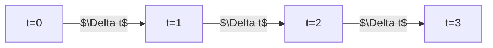

# Fixed Step-Size Solvers

## Overview
Methods like Euler or Midpoint method use a constant $\Delta t$.

## Significance
They guarantee predictable execution time, crucial for real-time systems and production.

## Diagram

