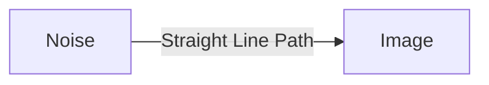

# High-Fidelity Generative Flow Matching

## Application
A framework for training continuous normalizing flows without simulation, allowing straight-line probability paths and highly efficient image generation.

## Diagram

