# Irregularly Sampled Medical Health Trackers

## Application
Medical data is often irregularly sampled. Neural CDEs excel at processing vital signs and lab results without imputation.

## Diagram

```mermaid
gantt
    title Irregular Medical Data
    dateFormat X
    axisFormat %s
    section Vital Signs
    Heart Rate : 0, 1
    Blood Pressure : 3, 4
    Temp : 8, 9
```

