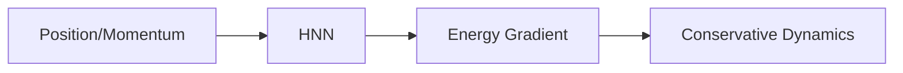

# Hamiltonian / Lagrangian Neural Networks

## Overview
These networks embed physics priors directly into the architecture by modeling the Hamiltonian (energy) or Lagrangian of the system.

## Mechanism
This guarantees that energy conservation and other physical laws are respected.

## Diagram

