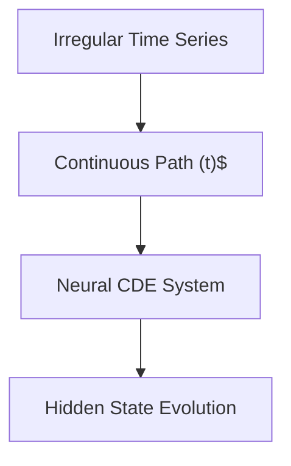

# Neural Controlled Differential Equations (Neural CDEs)

## Overview
Neural CDEs extend Neural ODEs to handle irregular time-series data seamlessly, serving as continuous-time RNNs.

## Mechanism
A continuous path (t)$ is interpolated from discrete observations, and the hidden state evolves according to:
dh(t) = f(h(t), \theta) dX(t)

## Diagram

