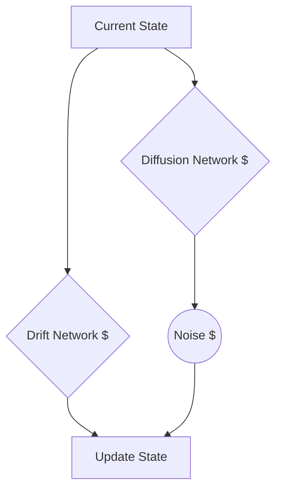

# Neural Stochastic Differential Equations (Neural SDEs)

## Overview
Neural SDEs incorporate Brownian motion directly into the differential equations, capturing uncertainty and complex noise patterns.

## Mechanism
dh(t) = f(h(t))dt + g(h(t))dW_t

## Diagram

