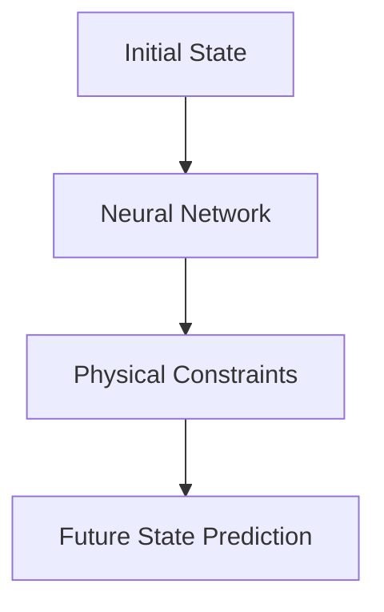

# Physical Dynamical Systems Forecasting

## Application
Models real-world systems like weather or orbits by embedding differential physics inside the network.

## Diagram

```mermaid
flowchart TD
    A[Initial State] --> B[Neural Network]
    B --> C[Physical Constraints]
    C --> D[Future State Prediction]
```
